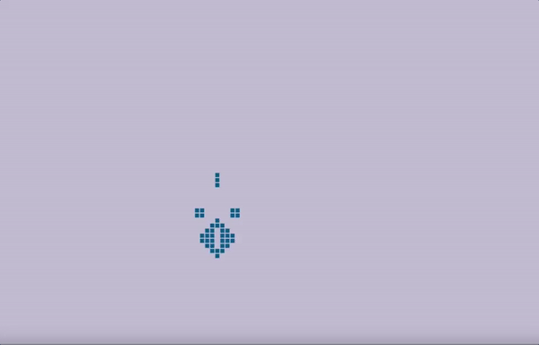

# automata
Playground for cellular automata stuff.

Cellular automata are super interesting computational structures that Stephen Wolfram believes show that the entire universe is computational. 
In the 40s, Johnny Von Neuman and others developed the earliest iteration of these a Los Alamos (while they should have been working on fission). A simple universe where a small number of extremely simple rules can exhibit complex behviours. 
In the late 60s and early 70s, John Conway expanded on these ideas to create the game of life, which is what we explore here. (Conway went on to spend the next few decades doing *many* incredible other things, and it's a bit irritating for him that the public know him for this work done early in his career).
In the game of life, a grid-like canvas contains squares that can either be on or off (white or black). The rules determining which squares are white or black are extremely simple and are based on what the 'population' around a single square is doing. 

1. Any live cell with fewer than two live neighbours dies, as if by underpopulation.
2. Any live cell with two or three live neighbours lives on to the next generation.
3. Any live cell with more than three live neighbours dies, as if by overpopulation.
4. Any dead cell with exactly three live neighbours becomes a live cell, as if by reproduction.

These four simple rules can create movement, patterns, oscillations and other unexpected behaviours that can persist for hundreds or even thousands of genereations.
Here we explore some of more popular seeding structures.

## Installation & Running

Needs numpy and pygame installed

``pip install pygame``

``pip install numpy``

Run with
``python main.py``

## Configuration

In main, there is the line

```configs.create_Thunderbird(world, 70,50)```

which controls which of several configurations to start with.
Use as many of these as you like to start with different setup configurations.
Any mobile automata can interact with other automata to produce new behaviours.

Currently configured automata include
* Oscillators
  * Blinkers
  * Toad
* Spaceships
  * Glider
* Methuselahs (long lived automata)
  * R-Pentamino
  * Thunderbird

# Gallery
__The Thunderbird Methuselah__

This is the last 30 seconds of one of the standard set pieces running



